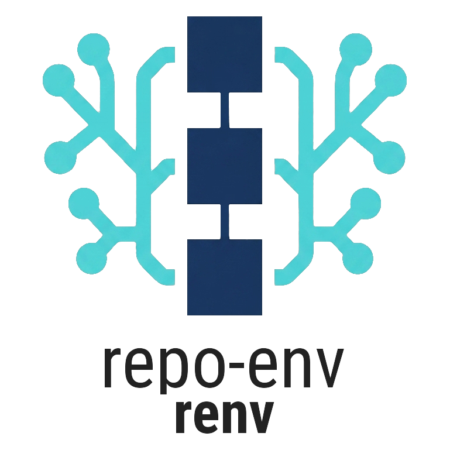

<p align="center">
  
</p>

<p align="center">
  <a href="https://github.com/ditschi/repo-env/actions/workflows/main.yml"></a>
  <a href="https://pypi.org/project/repo-env/"></a>
  <a href="https://ditschi.github.io/repo-env/"></a>
  <a href="LICENSE"></a>
</p>

Build and operate isolated **git-worktree environments** across many
repositories. The command is `renv`; the distribution is `repo-env`.

**[Full documentation →](https://ditschi.github.io/repo-env/)**

An *environment* is a named directory containing one git worktree per selected
repository. Create it from repos matching a glob in a source directory, run
commands across every worktree, and open bulk pull requests — all from one CLI.

## Install

```sh
uv tool install repo-env      # or: pipx install repo-env
renv --help
```

Requires **Python 3.10+**, **Git 2.38+**, Linux or macOS. `renv pr` needs [GitHub CLI](https://cli.github.com/) (`gh`).

## Quick start

```sh
renv init -s ~/src -d ~/envs -y
renv create web -s ~/src -b feature/x --activate
renv ls
cd "$(renv path web)"
renv run -- git status
renv pr web --title "feat: migrate X" --push   # optional --push
renv rm web --delete-files
```

## Design

- Command: `renv` · Distribution: `repo-env` · Import package: `repoenv`
- POSIX-first (Linux/macOS), Python 3.10+ (3.12 recommended), Typer CLI
- User config = YAML; machine state = JSON under `REPOENV_HOME`
- Source clones are **read-only**. Destructive ops require explicit flags

## Development

```sh
uv tool install nox
nox                 # default gates: syntax, tests, lint, types, imports, dead code, dupes, cycles
nox -s tests        # unit tests with coverage
nox -s integration  # integration tests (temp git repos, mocked gh)
nox -s docs         # build docs (--strict)
nox -s docs_serve   # local preview at http://127.0.0.1:8000
```

If nox reports a missing interpreter (for example `tests-3.14`):

```sh
uv self update
uv python install 3.14
nox -s tests-3.14 --download-python always
```

Quality: line length 110, ruff + black + flake8 + isort + mypy + vulture + fawltydeps.
