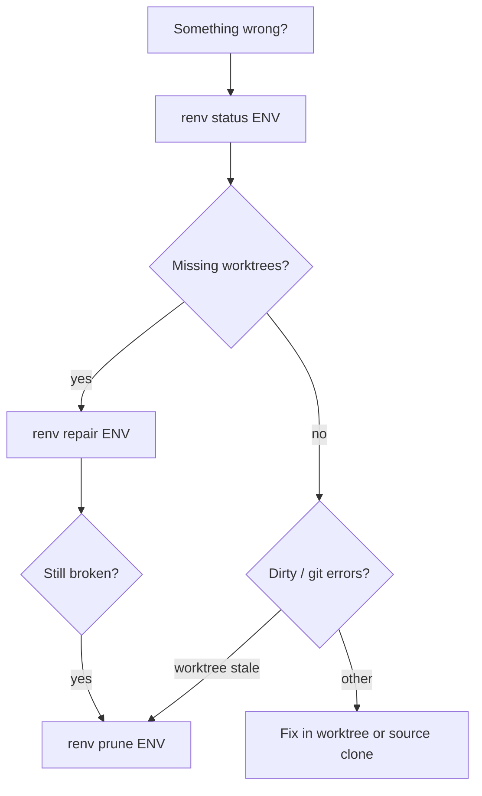

# Troubleshooting

Common problems and the commands that fix them.

## Quick diagnostic flow



Always start with:

```bash
renv status web          # or: renv check web  (same command)
renv status web --json     # machine-readable
```

## Missing worktree directories

**Symptom:** `renv status` shows repos as missing; you deleted a subdirectory under the env by hand.

**Fix:**

```bash
renv repair web
renv repair web --dry-run   # preview first
```

`repair` recreates worktrees from registry metadata (branch, source path, etc.).

## Stale git worktree metadata

**Symptom:** `git worktree add` fails with “already exists” but the folder is gone; orphaned worktree entries in the source repo.

**Fix:**

```bash
renv prune web
renv repair web
```

`prune` runs `git worktree prune` in each source repository linked to the environment.

## Environment deleted on disk but still in registry

**Symptom:** `renv create web …` says environment already exists after you removed the folder manually.

**Fix:** Re-run `renv create` with the same name — stale registry entries for missing directories are reconciled automatically. Or remove explicitly:

```bash
renv rm web --delete-files    # if any files remain
renv rm web                   # registry-only cleanup
```

## No environment specified

**Symptom:** `No environment specified and the current directory is not inside one.`

**Fix (pick one):**

```bash
renv activate web             # persist default
renv create web … --activate  # set on create
cd "$(renv path web)"         # then omit ENV (CWD wins)
renv run web -- git status    # explicit name
```

## Lock file left behind

**Symptom:** `.repoenv.json.lock` or `registry.json.lock` exists after a crash.

Lock files record PID, host, user, and timestamp while a write is in progress. After a clean exit they are removed. If a process died mid-write:

1. Check the lock file JSON for `pid` / `user`.
2. Confirm no `renv` process is still running.
3. Remove the stale lock file manually if needed, then retry.

## `renv pr` failures

**Symptom:** `The GitHub CLI 'gh' is not available.`

Install and authenticate [GitHub CLI](https://cli.github.com/):

```bash
gh auth login
gh auth status
```

Push branches yourself, or pass `--push`:

```bash
git push   # in each worktree, or:
renv pr web --title "feat: …" --push
```

## Branch already checked out elsewhere

**Symptom:** worktree creation fails because the branch is active in another worktree.

**Fix:** use `--on-branch-conflict` on `create`, `add`, or `repair`:

| Value | Behavior |
|-------|----------|
| `detach` (default) | create a detached worktree at the branch tip |
| `move` | stash, remove the other worktree, check out the branch here |
| `fail` | abort with an error |

## Corrupt registry

**Symptom:** JSON parse or validation errors loading `registry.json`.

1. Restore from backup if you have one (`registry.json.bak` may exist).
2. Fix invalid entries manually (see [Configuration](configuration.md)).
3. As last resort, remove the registry and re-import environments with `renv import`.

## Getting more help

- `renv <command> --help` — authoritative flags for your installed version
- [Commands reference](commands.md)
- [Concepts](concepts.md)
